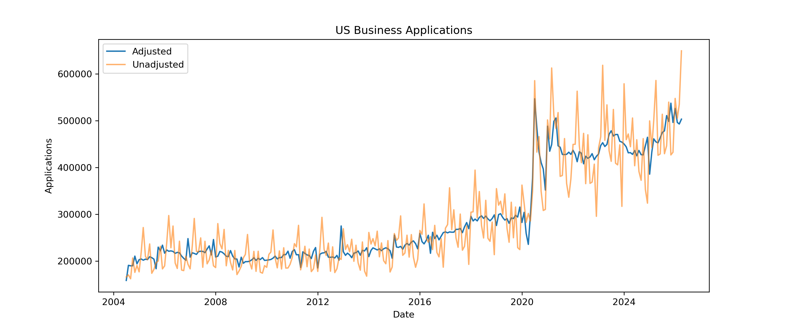
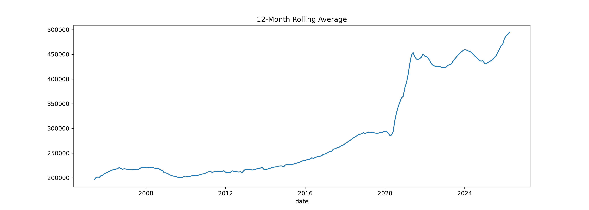
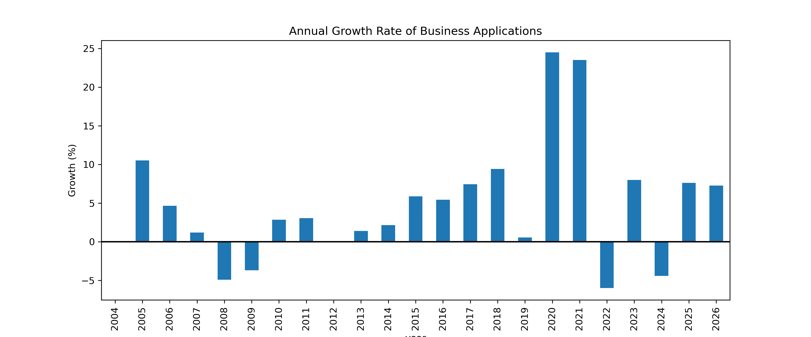
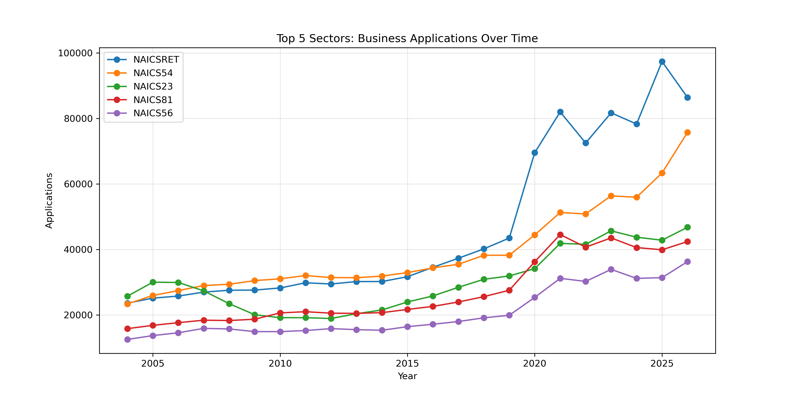
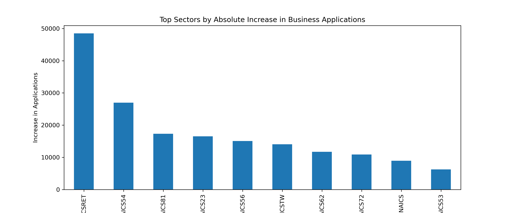
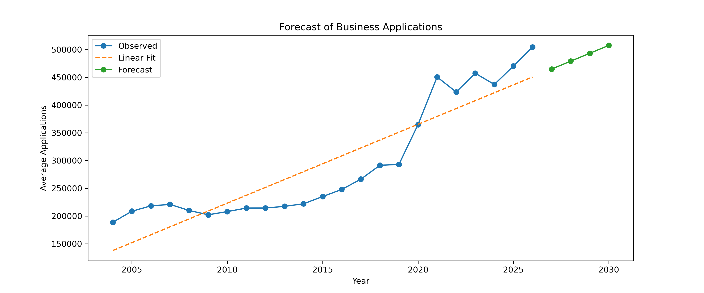
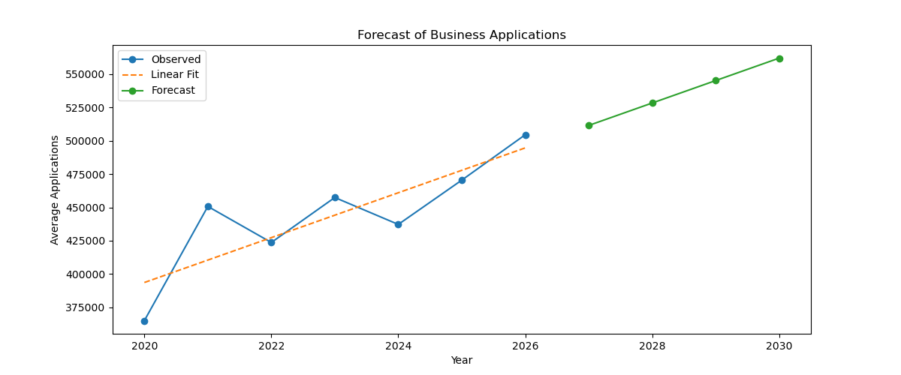

# 📊 US Business Applications Analysis (2004–2026)

## Overview

This project analyzes **U.S. Business Formation Statistics (BFS)** data from the U.S. Census Bureau to investigate long-term business formation trends, evaluate the impact of COVID-19 on entrepreneurial activity, identify the sectors that contributed most to post-pandemic growth, and develop a simple forecasting model using Linear Regression.

The analysis combines exploratory data analysis (EDA), sector-level comparisons, growth metrics, and predictive modeling to better understand how business applications evolved over the last two decades.

---

# Research Questions

This project aims to answer the following questions:

1. How have business applications evolved in the United States since 2004?
2. Did COVID-19 significantly affect business formation activity?
3. Which sectors contributed the most to post-pandemic growth?
4. How do percentage growth and absolute growth provide different perspectives?
5. Can historical trends be used to forecast future business application activity?

---

# Dataset

## Source

**Business Formation Statistics (BFS)**

U.S. Census Bureau

https://www.census.gov/econ/bfs/

The BFS dataset provides monthly counts of business applications filed in the United States and is widely used as an indicator of entrepreneurial activity and economic dynamism.

---

## Variables Used

| Variable     | Description                          |
| ------------ | ------------------------------------ |
| date         | Observation date                     |
| year         | Calendar year                        |
| month        | Calendar month                       |
| value        | Number of business applications      |
| naics_sector | Industry sector                      |
| geo          | Geographic region                    |
| sa           | Seasonal adjustment indicator        |
| series       | Business Formation Statistics series |

---

# Repository Structure

```text
.
├── BusinessApplications.ipynb
├── README.md
├── data/
│   └── business_applications.csv
│
└── figures/
    ├── adj_serie.png
    ├── annual_growth.png
    ├── top5sector.png
    ├── top_sector_abs.png
    ├── twelve_month_rolling.png
    ├── fore_all_year.png
    ├── fore_2020_year.png
    ├── adj_avg_app.png
    └── unadj_avg_app.png
```

---

# Methodology

The analysis consists of five major stages.

## 1. Data Cleaning

* Converted date fields into datetime format.
* Filtered observations to include only:

  * United States (`geo = US`)
  * Relevant business application series.
* Removed unnecessary columns.
* Created annual aggregates.

---

## 2. Exploratory Data Analysis

The exploratory analysis focused on:

* Historical business application trends.
* Seasonality patterns.
* Rolling averages.
* COVID-19 impacts.
* Industry-level comparisons.

---

## 3. Sector Analysis

Industry sectors were compared using:

* Historical averages.
* Percentage growth.
* Absolute growth.

This distinction is important because sectors with smaller initial values can exhibit high percentage growth while contributing relatively few additional applications.

---

## 4. COVID-19 Impact Analysis

The study compares:

* Pre-COVID period (2004–2019)
* Post-COVID period (2020–2026)

to identify structural changes in business formation activity.

---

## 5. Forecasting

A simple Linear Regression model was developed to forecast future business application activity.

Two forecasting approaches were explored:

1. Using the entire historical period (2004–2026)
2. Using only the post-COVID period (2020–2026)

The second approach was considered more representative because COVID-19 introduced a structural break in the historical trend.

---

# Results

## Business Applications Over Time

Business applications remained relatively stable between 2004 and 2015 before entering a period of sustained growth. A dramatic increase occurred following the COVID-19 pandemic.



### Key Findings

* Relatively stable growth before 2015.
* Accelerated growth after 2016.
* Significant structural shift after 2020.

---

## Rolling Average Trend

The 12-month rolling average smooths short-term fluctuations and reveals the long-term trend.



### Key Findings

* Strong upward trend after 2016.
* Sharp increase beginning in 2020.
* Elevated business formation activity persists through 2026.

---

## Annual Growth Rate

Annual growth rates highlight periods of acceleration and contraction.



### Key Findings

* Moderate growth before COVID-19.
* Exceptional growth in 2020 and 2021.
* Growth remains positive despite post-pandemic normalization.

---

## Top Five Sectors

The five sectors with the largest business application volumes were:

* Retail Trade (NAICSRET)
* Professional Services (NAICS54)
* Construction (NAICS23)
* Other Services (NAICS81)
* Administrative and Support Services (NAICS56)



### Key Findings

Retail Trade and Professional Services consistently generated the highest business application volumes throughout the study period.

---

## Sector Growth by Absolute Increase

To identify which sectors contributed the most new applications after COVID-19, absolute changes were calculated.



### Key Findings

* Retail Trade contributed the largest increase.
* Professional Services ranked second.
* Construction and Other Services also experienced substantial gains.

---

## Percentage Growth vs Absolute Growth

An important finding is that sector rankings vary depending on the growth metric used.

For example:

* NONAICS exhibited the highest percentage growth.
* Retail Trade generated the largest absolute increase.

This demonstrates why percentage growth should always be interpreted alongside absolute growth.

---

## Forecast Using Full Historical Data

A Linear Regression model was trained using annual data from 2004–2026.



### Observation

The model captures the long-term upward trend but underestimates the post-COVID structural shift.

---

## Forecast Using Post-COVID Data

A second model was trained using only observations from 2020–2026.



### Observation

This model better reflects current business formation dynamics and projects continued growth through 2030.

---

# Limitations

Several limitations should be considered when interpreting these findings.

## 1. No Causal Inference

This analysis identifies patterns and associations but does not establish causal relationships.

## 2. Applications Are Not Businesses

The dataset measures business applications rather than successful business creation.

## 3. Business Outcomes Are Unknown

The dataset does not contain information regarding:

* Application approval
* Business openings
* Business survival
* Business closures

## 4. Sector Aggregation

NAICS categories remain highly aggregated and may conceal important differences among subsectors.

## 5. National-Level Analysis

The analysis focuses exclusively on observations where:

```python
geo == "US"
```

Therefore, results should not be interpreted as representative of individual states or regions.

## 6. Forecasting Simplicity

The forecasting model uses simple Linear Regression and does not account for:

* Interest rates
* Inflation
* Labor market conditions
* Economic cycles
* Policy changes

Forecasts should therefore be interpreted as trend projections rather than precise predictions.

---

# Technologies Used

* Python
* Pandas
* NumPy
* Matplotlib
* Scikit-Learn
* Jupyter Notebook

---

# How to Run the Notebook

## 1. Clone the Repository

```bash
git clone https://github.com/yourusername/business-applications-analysis.git

cd business-applications-analysis
```

## 2. Install Dependencies

```bash
pip install pandas numpy matplotlib scikit-learn jupyter
```

or

```bash
pip install -r requirements.txt
```

## 3. Launch Jupyter Notebook

```bash
jupyter notebook
```

Open:

```text
BusinessApplications.ipynb
```

and execute all cells sequentially.

---

# Future Work

Possible extensions include:

* ARIMA forecasting
* Prophet forecasting
* State-level analysis
* Clustering of sectors
* Structural break testing
* Economic indicator integration
* Advanced machine learning forecasting models

---

# Author

**José Arturo Trelles Hernández**

Ph.D. in Astrophysics

Data Analysis • Machine Learning • Scientific Computing

---
